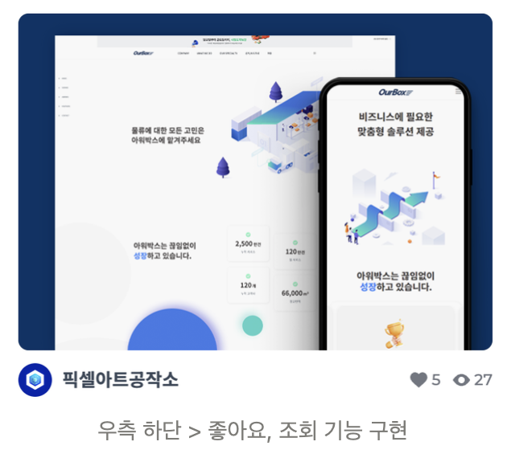

- 서점의 베스트셀러
- 영화관의 박스오피스
- 음악 스트리밍 서비스의 인기차트

위의 세 가지의 공통점은 무엇일까요?  
바로 랭킹시스템이라는 점입니다.

이번에는 아임웹에도 도입된 랭킹시스템인 리셀러 랭킹시스템에 대해  
리셀러 랭킹시스템이란 무엇이고, 어떤 요구사항이 있었으며, 이를 어떻게 설계했는지를 살펴봅니다.  
특히, 요구사항이 변경될 때를 대비해 어떻게 유연하게 설계했는지를 이야기해 볼까 해요!

# 리셀러와 포트폴리오란?

그전에 중요한 개념부터 짚고 넘어가야하는데요.  
바로 리셀러와 포트폴리오의 개념입니다.

아임웹은 아임웹서비스를 이용하여 멋진 사이트를 제작해 주는 리셀러분들이 있고,  
그 리셀러분들이 제작한 결과물들인 포트폴리오가 존재합니다.

아임웹 고객들은 직접 사이트를 제작하기도 하지만,  
리셀러들이 제작한 포트폴리오들을 살펴보고 제작의뢰를 맡길 수도 있는 구조입니다.

랭킹시스템은 바로 포트폴리오의 랭킹을 산정하는 시스템입니다.

# 랭킹시스템 이전은 어땠을까요?

기존의 포트폴리오 시스템은 직접 포트폴리오를 엄격하게 심사하는 방식을 취해왔습니다.

하지만 이 방식은 다양한 단점이 존재했는데요.

대표적으로는 필터링의 문제였습니다.  
의뢰인들에게 좋은 평가를 받았던 포트폴리오도 기본적으로 ‘등록일자’ 순으로 정렬되어  
노출이 어려운 문제가 있었죠.

# 이 문제는 랭킹시스템 이후에 어떻게 해결됐을까요?

의뢰인들에게 좋은 평가를 받은 포트폴리오는 ‘랭킹순’이라는 필터링으로 상위노출되어  
의뢰인들은 멋진 포트폴리오를 우선적으로 살펴볼 수 있게 되고,  
리셀러들은 그만큼 제작의뢰를 받아 수익을 실현할 수 있는 기회가 커질 수 있게 되었습니다.

자 그럼 랭킹시스템의 구현기능 대해 살펴볼까요?

# 랭킹시스템 구현기능은 크게 2 가지로 구성됩니다.

1. 점수 항목 기능(좋아요, 조회수)

랭킹을 매기려면 각 포트폴리오 별로 점수가 존재해야 합니다.  
랭킹시스템에서는 점수를 산정하기 위한 점수항목으로 좋아요와 조회수 기능을 구현했습니다.

2. 배점 상정 프로세스

포트폴리오 별 점수항목 기능이 구현되었으므로,  
각 점수항목을 취합하여 최종점수를 산정해야 합니다.  
랭킹시스템에서는 주 1회 종합적으로 이전 주 동안의 최종점수를 산정하고,  
그 점수에 따라 ‘랭킹순’ 필터링이 작동하게 됩니다.

# 요구사항을 기반으로 어떻게 설계할 수 있을까요?

좋아요 수와 조회수의 개념이 생겼고,  
주 1회 종합되는 최종점수가 있다는 건 알겠습니다.

잠깐!  
주 1회라는 사양은.. 변경가능성이 있어 보이는데요?  
이건 이따가 한번 더 살펴보기로 합시다!

# 자 그럼 이 요구사항을 어떻게 설계할 수 있을까요?

### 최초 설계

- 포트폴리오 테이블에 좋아요 수, 조회수, 최종점수 칼럼을 추가한다.
- 주 1회 최종점수를 산출해 낼 때 좋아요 수와 조회수를 기준으로 최종점수를 산정하여 업데이트한다.

언뜻 보면 간단히 요구사항을 해결을 할 수 있어 보입니다.  
고객은 포트폴리오에 좋아요, 조회수 추가 등의 인터랙션을 수행할 때 좋아요 수, 조회수 칼럼이 업데이트되고,  
주 1회마다 지금까지의 좋아요 수, 조회수를 기준으로 최종점수를 산정해 낼 수 있으니까요.

**그런데 문제는 ‘지금까지’의 좋아요 수, 조회수를 기준으로 최종점수를 산정해 내게 된다는 겁니다.**

즉, 총 N주차동안 최종점수를 산정해 낸다 가정했을 때,

- N-2주 차때는 N-3주 차의 좋아요 수, 조회수를 기준으로 최종점수가 산정되지만
- N-1주 차 때는 N-2주 차 + N-3주 차의 좋아요 수, 조회수를 기준으로 산정되고
- N주차 때는 N-1주 차 + N-2주 차 + N-3주 차의 좋아요 수, 조회수를 기준으로 산정됩니다.

우리는 N주차 때는 N-1주 차 때의 최종점수를 원하는데 말이죠!  
저는 이렇게 개선해보려고 해요.

### 개선된 설계

- 최초 설계로 변경된 포트폴리오 테이블 칼럼들은 유지
- 포트폴리오 로그 테이블 생성
- 어떤 포트폴리오에 어떤 사용자가 어떤 액션(좋아요, 조회)을 했는지를 로깅

변경된 부분을 살펴보니 로그테이블만 추가된 것처럼 보입니다.  
개선 결과는 어떨까요?

우리는 이제 사용자가 좋아요, 조회를 했을 때,

1. 포트폴리오의 좋아요 수, 조회수 테이블을 업데이트해 주면서
2. 포트폴리오 로그 테이블에도 로깅합니다.

그리고 배치프로세스가 주 1회 돌 때,

1. 이전 주차(ex 23.01.01 ~ 23.01.07)까지의 로그데이터만 취합하여 최종점수를 산정하고
2. 산정된 최종점수를 포트폴리오 테이블의 ‘최종점수’에 업데이트하면 됩니다.

자, 원래의 요구조건을 다시 살펴볼까요?

1. 좋아요 기능, 조회수기능 구현
2. 배점프로세스를 통해 이전 주 동안의 최종점수를 산정

모든 조건이 충족된 것을 볼 수 있습니다.

# 그런데 로그테이블은 더 많은 사용처가 있을 것 같은데요?

1. 고객문의나 비즈니스요구사항으로 인해 사용자의 액션을 살펴볼 소요가 있을 때 사용할 수 있습니다.

- 로그테이블은 랭킹시스템에 영향을 주는 점수항목에 대한 사용자의 액션을 로깅했으니까요!

2. 배점프로세스 취합 기간 사양이 ‘1주일’이 아니라, ‘2주일’이든 ‘한 달’이든 유연히 대응이 가능합니다.

- 로그에는 어차피 일주일이든 한 달이든 데이터가 쌓아있으니, 취합할 때 날짜 영역만 변경하면 될 테니까요!

3. 사용자의 행동데이터를 기록해 둘 수 있습니다.

- 아직은 좋아요 수, 조회수밖에 없는 점수항목이지만 점수항목은 확장가능성이 있습니다.
- 어떤 포트폴리오에 어떤 사용자가 언제 어떤 액션을 취했는지를 로깅이 가능합니다.
- 이 데이터를 사용하여 다양한 기능으로의 확장도 생각해 볼 수 있겠군요.

# 리셀러 랭킹시스템을 되돌아보며..

이 프로젝트를 진행함으로써  
백엔드 설계관점에서 2가지의 성장포인트가 있었던 것 같습니다.

첫 번째로는 백엔드개발자로서 비즈니스 요구사항을 살펴보고 설계를 할 때  
서버 및 DB부하, 효율적인 코드, 유지보수 등을 고려하는 것뿐만 아니라  
비즈니스 요구사항의 변경가능한 지점을 파악하여  
유연한 대처가 가능한 설계를 하는 것도 중요하다는 것을 다시 한번 상기시키게 된 점 이고,

두 번째로는 현재의 비즈니스 요구사항에서 개발된 기능임에도 불구하고  
그 기능이 더 많은 멋진 기능으로 확장될 수 있다는 확장성도 고려해볼만하다는 점 입니다.

예를 들어, 사용자의 행동데이터를 기록해 두는 로그테이블을 활용한다면

- ‘어떤 포트폴리오’를 ‘누가’ ‘언제’ ‘어떤 액션’을 취했는지 리셀러에게 제공할 수도 있겠네요.
- 그럼 리셀러는 제공받은 탄탄한 정보를 기반으로 더 퀄리티 높은 포트폴리오를 제작할 수 있을 테고요.
- 그리고 고객들은 퀄리티 높은 포트폴리오를 선택할 확률이 높아지는 선순환이 만들어질 수도 있을겁니다!

긴 글 읽어주셔서 감사합니다.

---

본 문서는 아임웹 기술문서에 기고된 글입니다.  
https://medium.com/imweb-tech/%EB%A6%AC%EC%85%80%EB%9F%AC-%EB%9E%AD%ED%82%B9%EC%8B%9C%EC%8A%A4%ED%85%9C%EC%9D%B4%EB%9E%80-%EC%9C%A0%EC%97%B0%ED%95%98%EA%B3%A0-%ED%99%95%EC%9E%A5%EC%84%B1-%EC%9E%88%EB%8A%94-%EC%84%A4%EA%B3%84%EC%97%90-%EB%8C%80%ED%95%98%EC%97%AC-486bca2e105f
